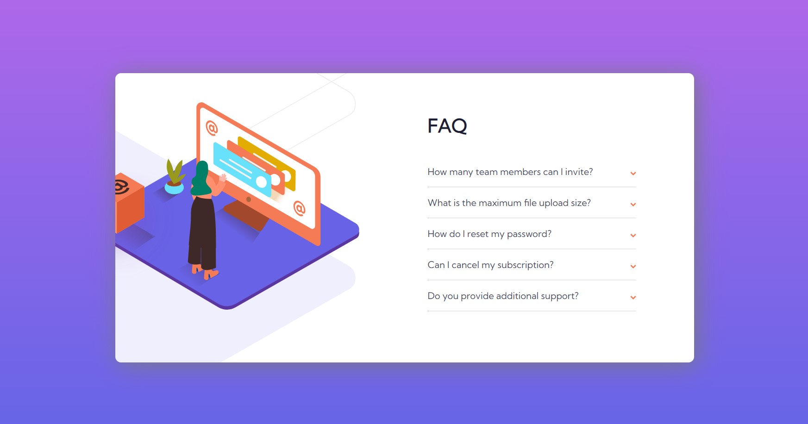
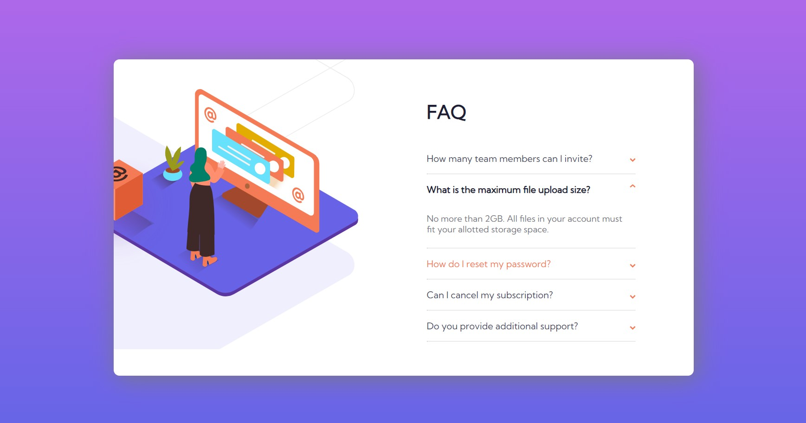
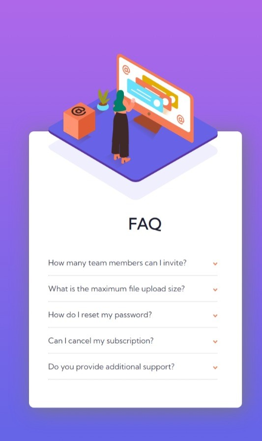

# Frontend Mentor - FAQ accordion card solution

This is a solution to the [FAQ accordion card challenge on Frontend Mentor](https://www.frontendmentor.io/challenges/faq-accordion-card-XlyjD0Oam). Frontend Mentor challenges help you improve your coding skills by building realistic projects. 

## Table of contents

- [Overview](#overview)
  - [The challenge](#the-challenge)
  - [Screenshot](#screenshot)
- [My process](#my-process)
  - [Built with](#built-with)
  - [What I learned](#what-i-learned)
- [Author](#author)

## Overview

### The challenge

Users should be able to:

- View the optimal layout for the component depending on their device's screen size
- See hover states for all interactive elements on the page
- Hide/Show the answer to a question when the question is clicked

### Screenshot





## My process

### Built with

- HTML3
- CSS custom properties
- Flexbox
- Media query
- jQuery
- java script

### What I learned

- how to have different svgs for different screen sizes.
- how to have images one on top of another.
- how to hide images in some parts.
- how to flip an image.
- how to position images.

```html
<div class="images">
      <picture>
        <source media="(max-width: 600px)" srcset="images\bg-pattern-mobile.svg" />
        
      </picture>

      <picture>
        <source media="(max-width: 600px)" srcset="images\illustration-woman-online-mobile.svg" />
        
      </picture>

      

    </div>
```

```css
.images {
    position: relative;
    height: 500px;
    width: 500px;
    max-width: 500px;
    overflow: hidden;
}

.flip {
    -webkit-transform: scaleY(-1);
    transform: scaleY(-1);
}
```

## Author

- Github - [Razie](https://github.com/raziie)
- Frontend Mentor - [@raziie](https://www.frontendmentor.io/profile/raziie)
